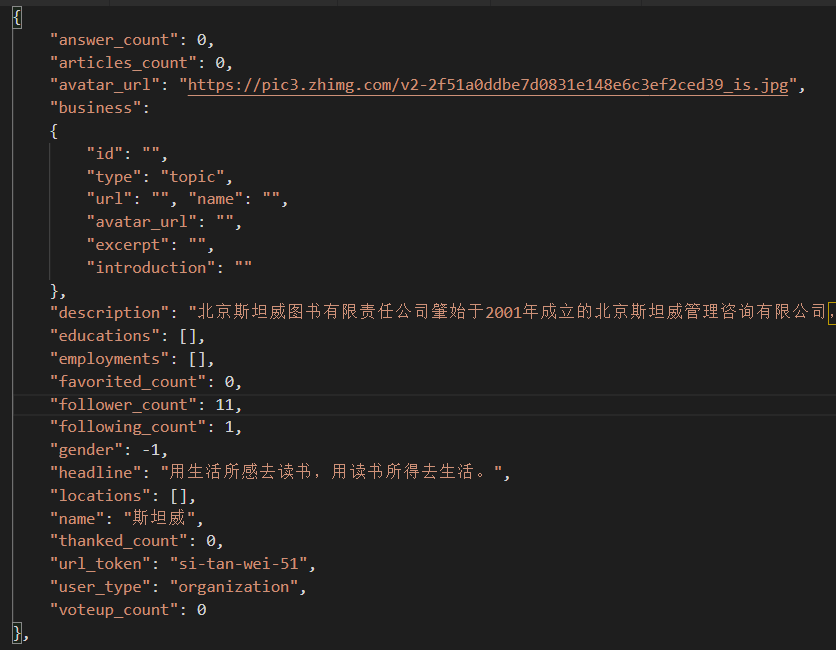

# Zhuhu_users_data_visualization
10W+知乎用户可视化方案

> 以2019年北京大学开放研究数据平台提供的**10W+知乎用户数据集**（中等规模）作为数据基础。

## 数据来源

数据来源于[北京大学开放研究数据平台](https://opendata.pku.edu.cn/dataverse/pku)。

> 姚, 若愚, 2019, "10W+知乎用户数据集", https://doi.org/10.18170/DVN/XLRXFR, 北京大学开放研究数据平台, V1

数据格式为单个json文件。数据集共有10万条用户数据。一个典型的用户数据如下：

数据包含了以下内容：

- `name`：昵称
- `url_token`：用户识别码
- `user_type`：用户类型
- `avatar_url`：头像链接
- `business`：所属领域
- `description`：个人描述
- `educations`：教育背景
- `employments`：职业背景
- `gender`：性别
- `headline`：签名
- `locations`：地区
- `answer_count`：回答数
- `articles_count`：文章数
- `voteup_count`：获赞数
- `thanked_count`：感谢数
- `favorited_count`：收藏数
- `follower_count`：被关注数
- `following_count`：关注数

